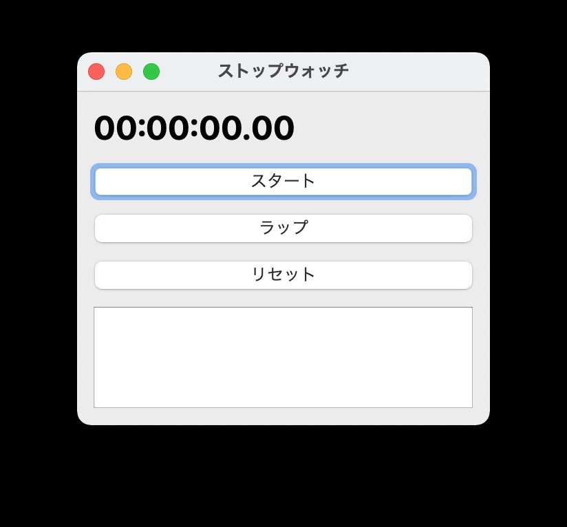

# PyStopwatch ⏱

**macOS Big Sur 11.7.10 対応、Python + PyQt5 製シンプルなストップウォッチアプリ**

---

## 🧰 特徴

- Python + PyQt5 で開発
- シンプルなボタン配置: スタート / ストップ / ラップ / リセット
- メニューバーでウィンドウの開閉可
- 簡潔なUI，軽量動作，使用メモリ最小
- 最大測定時間: 24時間

---

## 📸 UIスクリーンショット



---

## 🚀 インストール方法

### バイナリ配布 (推奨)

1. [Releases ページ](https://github.com/tattk/PyStopwatch/releases) から `.dmg` ファイルをダウンロード
2. `.dmg` をダブルクリックして `.app` を `/Applications` へドラッグ&ドロップ
3. 初回起動時、macOS のセキュリティ警告が出る場合は
   - `システム設定 > プライバシーとセキュリティ` で許可

---

## 🛠 開発者向け (ソースコードから動作させる場合)

```bash
git clone https://github.com/tattk/PyStopwatch.git
cd PyStopwatch
python3 -m venv venv
source venv/bin/activate
pip install -r requirements.txt
python stopwatch.py
```

---

## 📄 使用技術 / 開発環境

- macOS Big Sur 11.7.10
- Python 3.9+
- PyQt5

---

## 🔧 ビルドコマンド (pyinstaller)

```bash
pyinstaller --windowed --onedir --name "PyStopwatch" \
  --icon "app_icon.icns" \
  --add-data "app_icon.icns:." stopwatch.py
```


---

## 📍 配布形式

- .dmg .py

---

## 📃 ライセンス

MIT License

学習時間の計測用に必要十分な機能を持ったシンプルなストップウォッチです。  
よろしければ GitHub に Star や Issue をお願いします ✨

